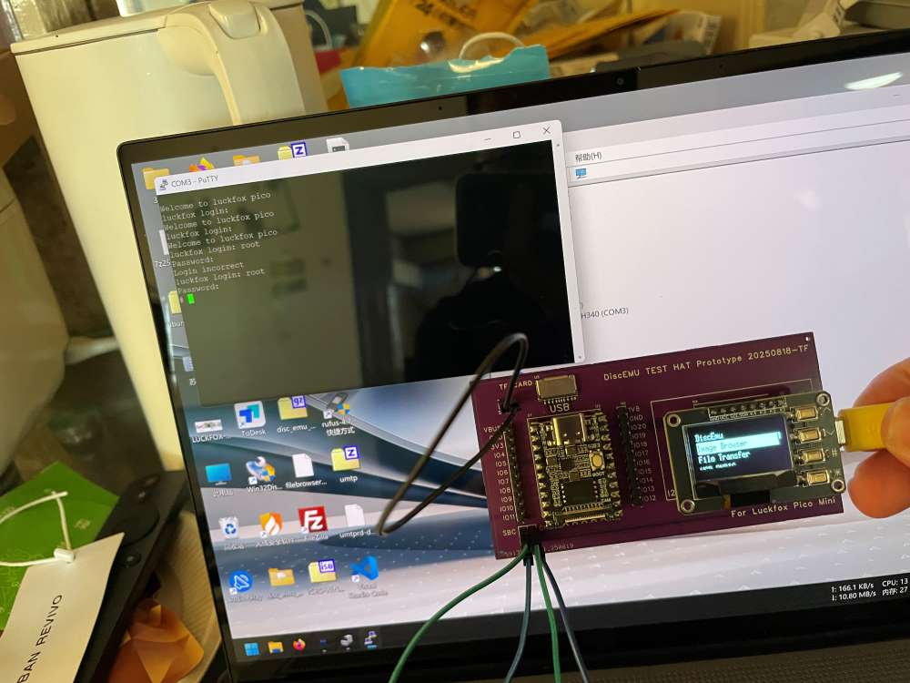

# DiscEmu-luckfox-pico-mini


A CD-ROM drive emulator based on Linux USB Gadget, on the [Luckfox Pico Mini](https://www.luckfox.com/Luckfox-Pico-Mini-A) (RV1103).

Forked from [driver1998/DiscEmu](https://github.com/driver1998/DiscEmu), Same Function Version with Milk-V Duo is [slzkud/DiscEmu](https://github.com/slzKud/DiscEmu).

Currently at prototype stage.



## Hardware info

- Luckfox Pico Mini
- SSD1306 I2C 128x64 OLED
- 3 * GPIO Button
### Pinout

|Function | Pin# |
|---------|------|
|OLED SCL | 15   |
|OLED SDA | 14   |
|Up Btn   | 6    |
|Down Btn | 7    |
|Enter Btn| 8    |


## Build

You can build this with the [official SDK](https://github.com/LuckfoxTECH/luckfox-pico).

This app depends on the [libu8g2arm](libu8g2arm) library and [boost](https://sourceforge.net/projects/boost/files/boost/1.88.0/) library. 

Change makefile with the new TOOLCHAIN_PREFIX,U8G2_PREFIX and BOOST_PREFIX, and use ``make`` to compile program.

- If you need to disable USB because need to debug, use ``make USB_ON=0`` to compile program. 

## Usage

- This app is statically linked by default, and should run fine on Luckfox Offical Image. 

- `S50usbdevice` in this repo is modified from the official image, with CD-ROM support added and fix some bugs, please use this verison with DiscEmu instead of the stock one.

- Place `disc-emu`,`run_usb.sh` and `make_fat32_img.sh` at `/root`, and make it start at boot up by creating `/etc/init.d/S80autorun` and `/root/autorun.sh`

- `/etc/init.d/S80autorun`

```bash
#!/bin/sh
[ -f /etc/profile.d/RkEnv.sh ] && source /etc/profile.d/RkEnv.sh
case $1 in
	start)
		[ -f /root/autorun.sh ] && sh /root/autorun.sh
		;;
	stop)
		[ -f /root/autorun_stop.sh ] && sh /root/autorun_stop.sh
		;;
	*)
		exit 1
		;;
esac
```
- `/root/autorun.sh`(with sdcard update function)

```bash
#!/bin/sh
OLD_PWD=$(pwd)
if [ -f /mnt/sdcard/disc-emu ]; then
    echo "Update New Discemu..."
    if cp -f /mnt/sdcard/disc-emu /root/discemu/disc-emu; then
        rm -f /mnt/sdcard/disc-emu
        chmod +x /root/discemu/disc-emu
    fi
    echo "Update New Discemu...OK"
fi
echo "Running Discemu..."
cd /root/discemu
./disc-emu &
cd "$OLD_PWD"   
```

- Replace `/etc/init.d/S50usbdevice` with repo one. You can start RNDIS at the main menu of DiscEmu.

- If you want DiscEmu to simulate an empty CD-ROM drive by default when it starts, please create an empty file in the path `/etc/normal_msc.flag`.

- If you need to use "File Transfer", you need to compile [uMTP-Responder](https://github.com/viveris/uMTP-Responder). After compiling, place the compiled `umtprd` in `/usr/bin` and the [`umtprd.conf`](umtprd/umtprd.conf) in `/etc/umtprd`.

- DiscEmu looks for ISO images at `isos` in the working directory, so `/root/isos` as configured above. You might link iso folder with /mnt/sdcard to use whole sdcard.

- Due to Linux kernel limitations, DVD images are not fully supported. Also there is a ~2.2GiB file size limit, there is a third-party patch to bypass this, see https://lkml.org/lkml/2015/3/7/388 for more details.

